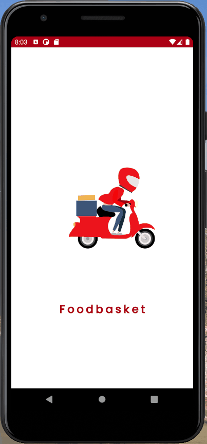
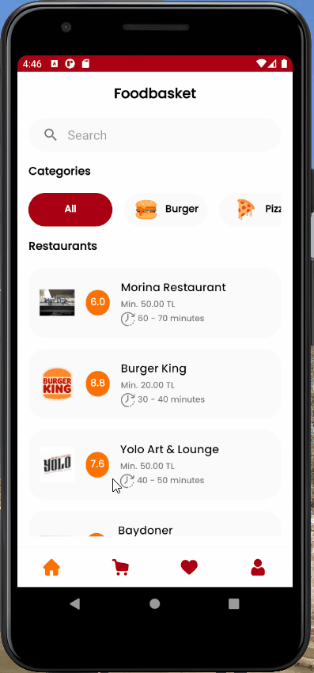
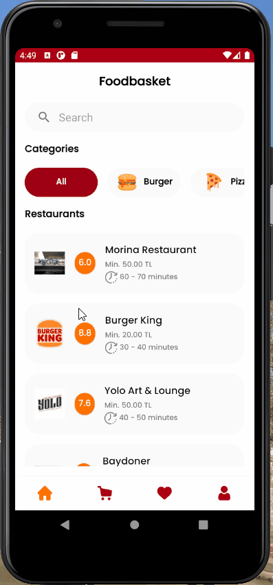
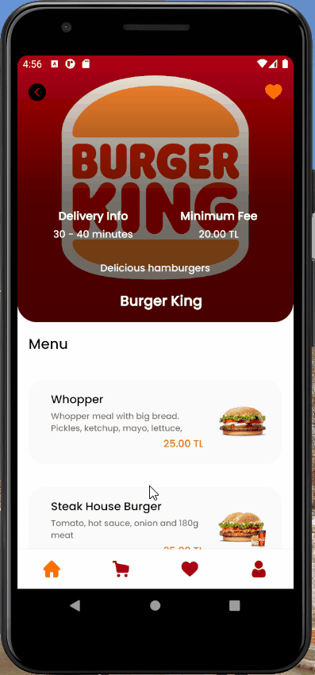
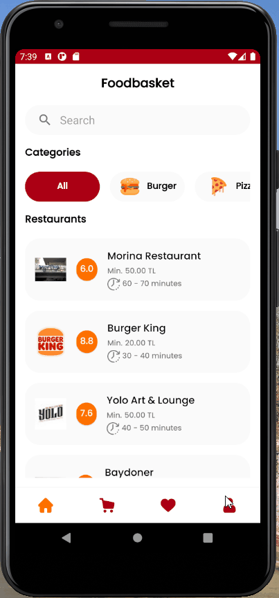

# Foodbasket Application

#### Food delivery application for Kodluyoruz Yemeksepeti Android Bootcamp.

## Used Technologies

* MVVM Architecture
* Retrofit, okHttp
* Dagger Hilt
* Coroutine
* Firebase Authentication
* Lottie Animations
* Firebase Cloud Functions for REST APIs

## Splash Onboarding and Authentication Screens

- Login and sign up is controlled by Firebase Authentication.
- If user successfully login or sign up, access token is saved in Shared Prefences to request authorized APIs.
- In splash screen, if user already logged in, navigates into the application.
        

## Home Screen

- You can show restaurants in Home Screen.
- The restaurants can be searched or filtered by its category.

       
## Restaurant Details Screens

- You can show restaurant details and its menu in Restaurant Details Screen.
- You can add the restaurant to favorites by clicking on heart icon

## Meal Details Screens
      
- You can add the meal to the cart after choose its ingredients and quantity.
        

## Cart and Favorite Restaurants Screens

- You can set quantities of meals or delete them.

- You can show favorite restaurants and can be deleted by clicking on heart icon.

## Profile Screen

- You can show user details and last orders in the Profile Screen.
- You can edit user details or log out from settings.
- There are two types of user.Admin and normal users. Admin user can add restaurant and meals or delete them.
       

